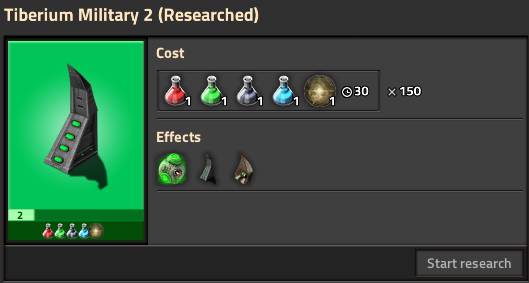
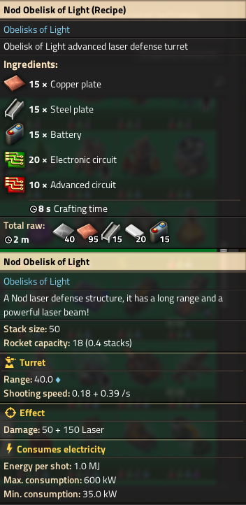
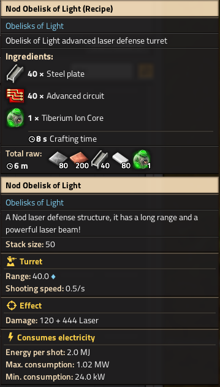

# Obelisks of Light - Factorio 2.0 Adaptation

## Overview
The **Obelisks of Light** mod brings the iconic Nod Obelisk from Command & Conquer - Tiberian Wars into the world of Factorio! Originally developed by **Gouitsu** for Factorio 1.1, [this](https://mods.factorio.com/mod/Obelisks-of-light) mod has now been **forged** and updated to Factorio 2.0 by **DiabloPower**.

### What's New?
- **Facotrio & Conquer integration**:
  Full integration with Factorio and Conquer. Configurable within Mod Settings.
  
- **Updated for Factorio 2.0**:
  Fully adapted to work with the latest version of Factorio, including compatibility with **Space Age** and other mods like **Quality**.

- **Removed Legacy Data**:
  Outdated and unnecessary data has partially been cleaned up to streamline the mod and improve performance.

- **Reorganized Structure**:
  The files and technologies have been restructured for better clarity and functionality.

## Screenshots
Take a look at some of the highlights of this mod:

### The Obelisk of Light
  
*The iconic Obelisk of Light in all four buildable directions.*

  
*Dirty deeds have to be done!*

  
*The Science behind the Obelisks.*

  
*The Science behind the integrated Obelisks.*

  
*some stats with and without integraten... after a few upgrades...*

## Credits
A big thank you to [SacredAnarchy](https://mods.factorio.com/user/Sacredanarchy) for the original Textures of the mod!
And to [Gouitsu](https://mods.factorio.com/user/Gouitsu) for the original mod!

## Compatibility
- **Factorio Version**: 2.0
- **Dependencies**:
  - Space Age Mod (optional)
  - Quality Mod (optional)
